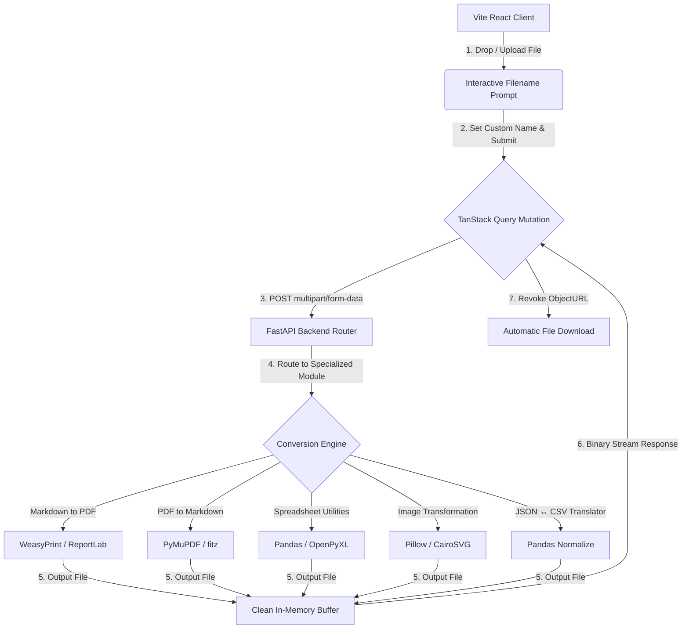

# 🚀 Nova Converter — Universal File & Data Workspace

Nova Converter is a professional-grade, privacy-first file and data conversion platform. Engineered with a React (TypeScript) frontend and a FastAPI (Python) backend, it processes all documents securely and delivers lightning-fast execution.

* **Live Deployed Backend**: [https://document-converter-puyg.onrender.com](https://document-converter-puyg.onrender.com)
* **Live API Documentation**: [https://document-converter-puyg.onrender.com/docs](https://document-converter-puyg.onrender.com/docs)

---

## 🎨 Architecture & Flow



---

## 🌟 Key Features

### 1. 🌿 MD to PDF (Markdown → PDF)
Converts formatted Markdown or raw text files into clean, beautifully styled PDF documents. 
- Utilizes **WeasyPrint** for high-fidelity CSS-styled printing, falling back to robust **ReportLab** XML flowables if WeasyPrint is unavailable.
- Preserves headers, tables, bold/italic markup, lists, blockquotes, and code snippets.

### 2. 📄 PDF to MD (PDF → Markdown)
Parses PDF documents and extracts raw and structural text, converting paragraphs, headers, and code columns into structured, readable Markdown (`.md`) format.

### 3. 🖼️ Image Converter (Multi-Format Support)
Transforms images across several formats (`PNG`, `JPG`, `WEBP`, `GIF`, `BMP`, `TIFF`, `ICO`, `SVG`) while preserving transparency and pixel density.

### 4. 📊 Spreadsheet Suite
- **Excel to CSV**: Converts `.xlsx` and `.xls` workbooks. Automatically compresses multi-sheet workbooks into an organized `.zip` file of separate CSV sheets.
- **CSV to Excel**: Imports raw CSV files and styles them into professional, color-blocked Excel `.xlsx` spreadsheets for presentation.

### 5. 🔀 JSON ↔ CSV Data Translator (Dual-Way)
A robust data translator designed for technical notebooks, agricultural records, and developers.
- **JSON to CSV**: Automatically normalizes nested data layouts (hierarchical keys) into flat CSV columns using Pandas.
- **CSV to JSON**: Parses table rows and generates a clean, indented JSON array of objects (`indent=2`) for raw database consumption.

---

## 💎 Dynamic Filename Prompt Flow
To deliver a premium, fluid user experience, the workspace avoids automatic downloading with random filenames. Instead, it intercepts uploads:
1. **Interactive Modal**: Dropping or selecting a file opens a spring-animated glassmorphic dialog.
2. **Auto-Naming**: The modal automatically extracts the base name of your file as a suggested download name.
3. **Reactive Badging**: If utilizing the **JSON ↔ CSV** translator:
   - Selecting a `.json` file automatically shows a **`.csv`** output badge.
   - Selecting a `.csv` file automatically shows a **`.json`** output badge.
4. **Instant Action**: Pressing **Enter** or clicking **Convert & Download** initiates the pipeline.

---

## 🛠️ Local Installation & Development

Ensure you have **Node.js (v18+)** and **Python (v3.10+)** installed on your system.

### 1. Backend Setup (FastAPI)
Navigate to the backend directory:
```bash
cd backend
```

Create a virtual environment and activate it:
```bash
# Windows (PowerShell)
python -m venv venv
.\venv\Scripts\activate

# macOS / Linux
python3 -m venv venv
source venv/bin/activate
```

Install the dependencies:
```bash
pip install -r requirements.txt
```

Launch the hot-reloading FastAPI server (for local development):
```bash
uvicorn main:app --port 8000 --reload
```
*The backend API runs locally at `http://localhost:8000` (or you can connect to the live instance at `https://document-converter-puyg.onrender.com`).*

---

### 2. Frontend Setup (React & Vite)
Open a new terminal session and navigate to the frontend directory:
```bash
cd frontend
```

Install node packages:
```bash
npm install
```

Run the local Vite development server:
```bash
npm run dev
```
*The frontend portal will be live at `http://localhost:5173`.*

---

## 🛡️ Security & Privacy Architecture
* **RAM Processing**: All document parsing is handled directly in raw memory buffers.
* **Immediate Deletion**: Temporary files generated during formatting buffers are deleted immediately after download triggers are dispatched.
* **100% Offline**: Zero external analytics tracking, cloud storage syncs, or third-party webhooks—making it ideal for proprietary, enterprise, or sensitive data.
